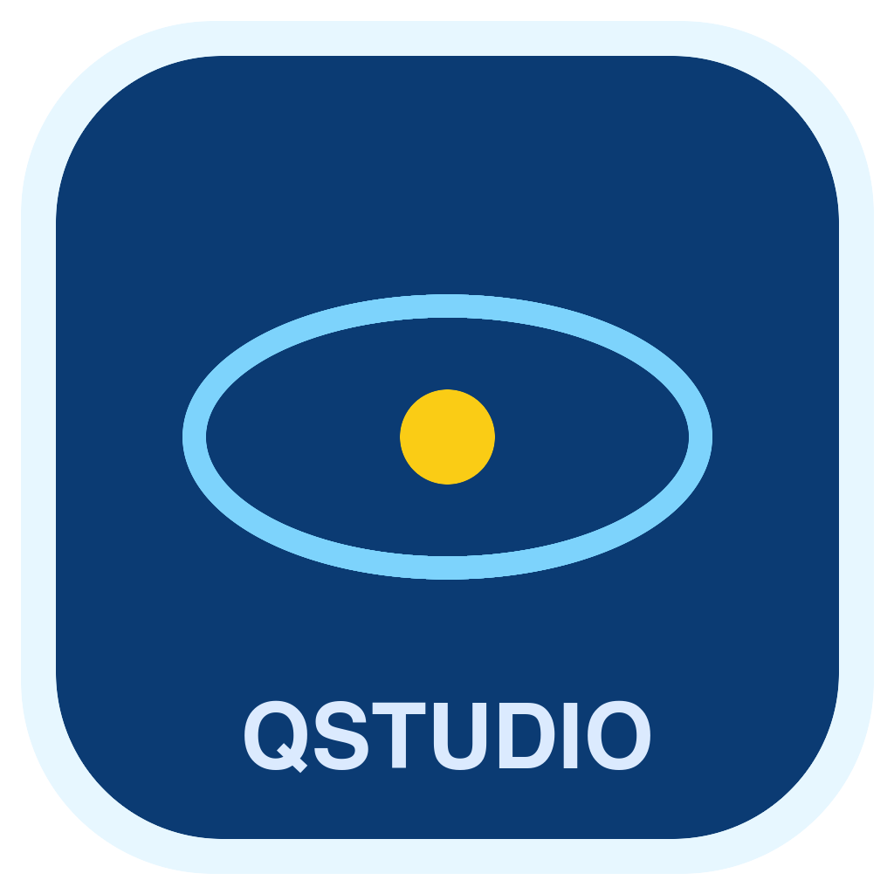
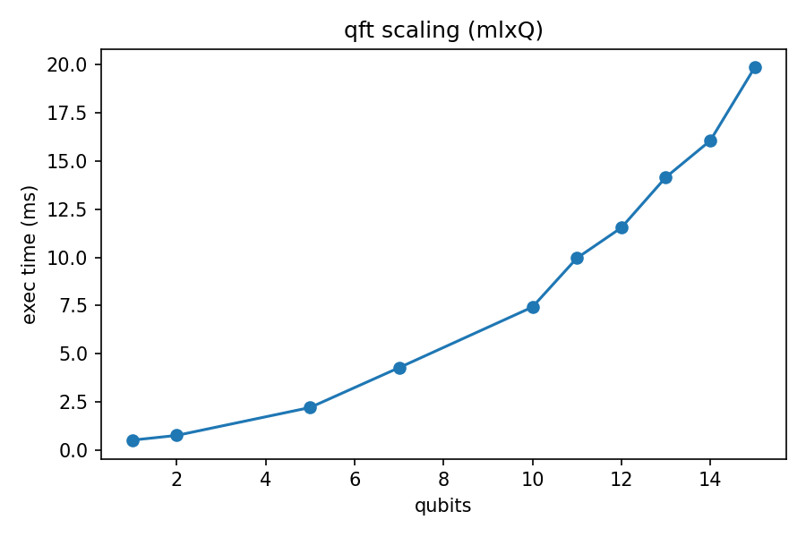
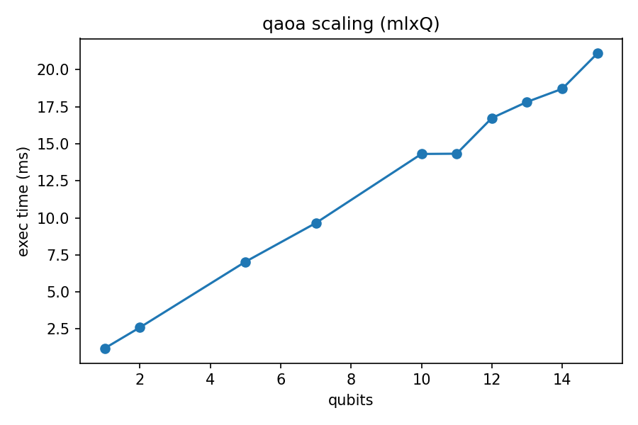
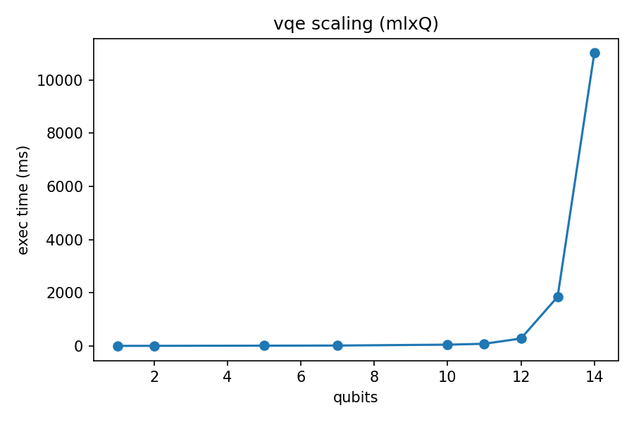
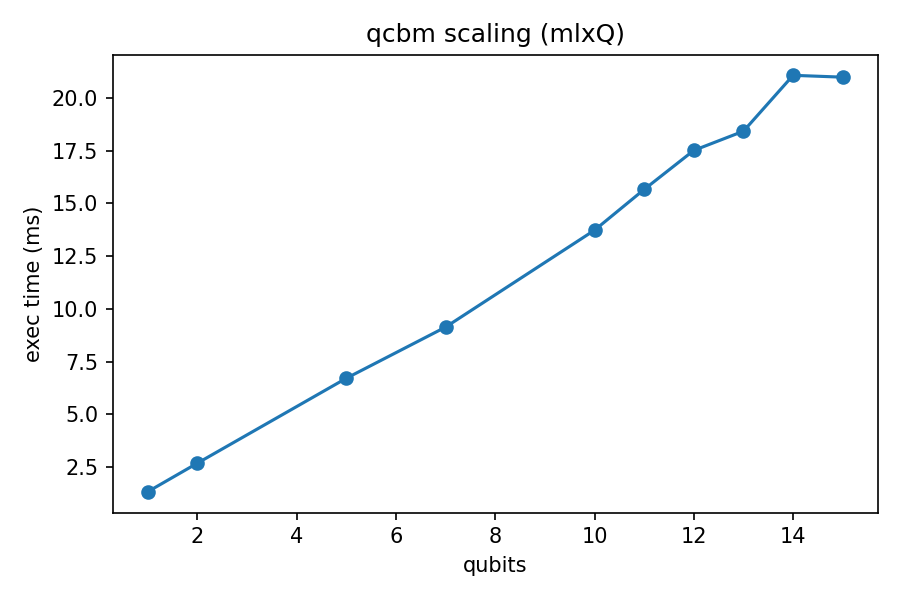
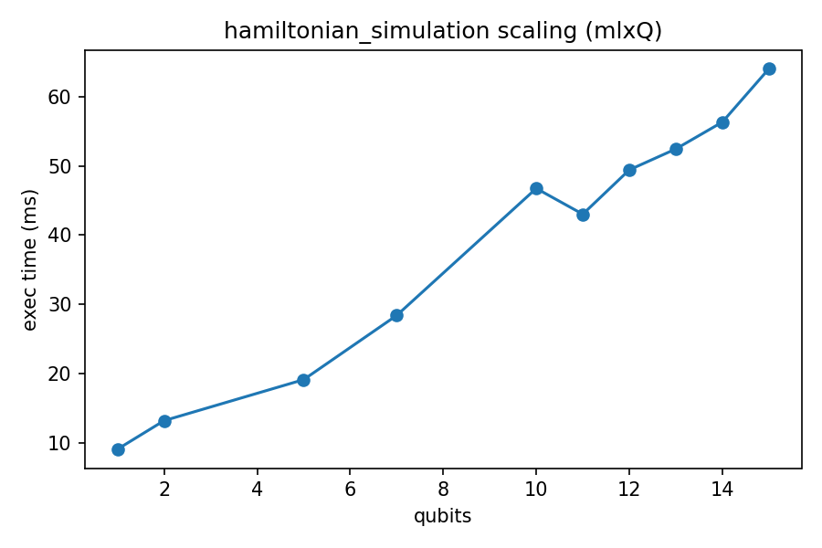
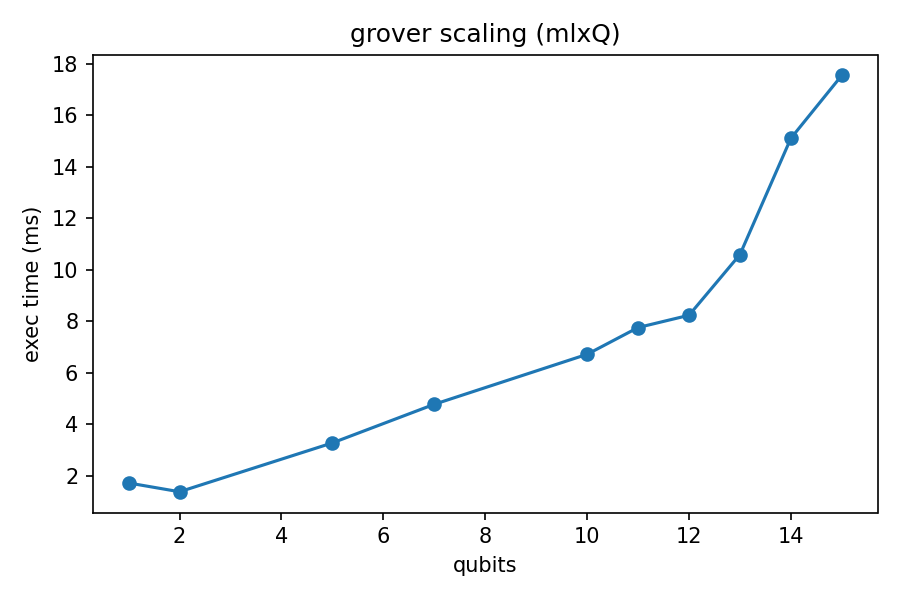

<div align="center">
  
  <h1>osxQ / QuantumStudio</h1>
  <p><b>Apple Silicon quantum benchmarking stack</b> with a local simulator, reproducible benchmark pipelines, and a desktop UI.</p>
</div>


- Website: https://boltzmannentropy.github.io/osxQuantumWEB/
- Repository: https://github.com/BoltzmannEntropy/osxQ
- Camera-ready PDF: `QUANTICS_2026_14_CR.pdf`
- Paper source: `paper/quantics-lncs-2026/mlxquantum_quantics2026_lncs.tex`

## Extended Introduction

osxQ exists to make Apple Silicon quantum benchmarking practical, local-first, and reproducible. The project packages three layers into one workflow:

1. **Research layer**: QUANTICS 2026 methodology and benchmark framing.
2. **Simulator layer (`mlxq`)**: state-vector and MPS backends on MLX for Apple Silicon.
3. **Product layer (`QuantumStudio`)**: desktop run orchestration, monitoring, and export.

The core motivation is straightforward: Apple Silicon uses a unified memory model, but there is no default native MLX quantum runtime shipped as a platform quantum simulator. osxQ fills that gap with a local simulator stack and benchmark harnesses for QFT, QAOA, VQE, QCBM, Grover, Hamiltonian/time-evolution workflows, and OpenQASM runs.

This repository is designed for publication-grade reproducibility:
- deterministic CLI run paths
- structured CSV/JSON output
- frozen artifact promotion under `assets/benchmarks-frozen/`
- UI+CLI parity for auditability

## Project Structure

- `src/` Python simulator + benchmark code (`mlxq`)
- `bench.sh` single/full benchmark launcher
- `bench_with_logging.sh` orchestrated benchmark runs with logging/promotions
- `bench/runs/` per-run outputs (`run_YYYYmmdd_HHMMSS`)
- `quantumstudio/` desktop UI + backend + control scripts
- `datasets/qasm/local/` OpenQASM local corpus
- `paper/quantics-lncs-2026/` paper source and paper-linked images
- `assets/benchmarks-frozen/` frozen benchmark artifacts and sample bundles

## Paper Context And Representative Results

From the QUANTICS 2026 workflow, representative scaling points (Apple Silicon, paper-aligned methodology):

- QFT @ 25q: ~7s scale
- QAOA @ 25q: ~11s scale
- Hamiltonian simulation @ 25q: ~40s scale
- Grover @ 25q: high-growth runtime regime

Use this repository’s frozen assets and run logs as the source of truth for exact run-by-run values.

## Installation (Full)

### 1) System prerequisites

- macOS 13.3+ recommended
- Apple Silicon (M1/M2/M3/M4)
- Python 3.10+ (3.11 tested heavily)
- Optional: Flutter SDK (for UI development builds)

### 2) Core Python environment

```bash
cd /Volumes/SSD4tb/Dropbox/DSS/artifacts/code/QuantumStudioPRJ/QuantumStudioCODE
python3 -m venv .venv
source .venv/bin/activate
pip install -U pip
pip install -e .
```

`pyproject.toml` includes core dependencies (`mlx`, `rich`, `numpy`) and optional groups.

### 3) Backend dependencies (QuantumStudio API)

```bash
pip install -r quantumstudio/backend/requirements.txt
```

### 4) Runtime path for local commands

```bash
export PYTHONPATH=src
```

### 5) Flutter UI dependencies (optional, for UI dev)

```bash
cd quantumstudio/flutter_app
flutter pub get
```

## Running Benchmarks

### Standard full-orchestrated run

```bash
cd /Volumes/SSD4tb/Dropbox/DSS/artifacts/code/QuantumStudioPRJ/QuantumStudioCODE
./bench_with_logging.sh
```

### 12-qubit smoke test (recommended health check)

```bash
cd /Volumes/SSD4tb/Dropbox/DSS/artifacts/code/QuantumStudioPRJ/QuantumStudioCODE
PYTHON_BIN=/Users/sol/.pyenv/shims/python3 ./bench_with_logging.sh --frozen-parity-12
```

### Single-circuit run example

```bash
PYTHON_BIN=/Users/sol/.pyenv/shims/python3 ./bench.sh --circuit variational_circuit --simulate-limit 12 --qubits 1,2,5,7,10,11,12
```

## Benchmark Catalog (Detailed)

The benchmark engine accepts the following circuit keys. For each benchmark below:
- Use the single-circuit form:
  - `./bench.sh --circuit <key> --simulate-limit <N> --qubits 1,2,5,7,10,11,12`
- Or run coordinated suites with:
  - `./bench_with_logging.sh --frozen-parity-12`

### 1) `hamiltonian_simulation`
- Purpose: product-formula simulation of spin Hamiltonians.
- Typical command:
```bash
./bench.sh --circuit hamiltonian_simulation --simulate-limit 12 --qubits 1,2,5,7,10,11,12
```

### 2) `time_evolution`
- Purpose: time-evolution scaling over qubit count.
- Typical command:
```bash
./bench.sh --circuit time_evolution --simulate-limit 12 --qubits 1,2,5,7,10,11,12
```

### 3) `trotter`
- Purpose: Trotterized evolution workload for depth/runtime growth.
- Typical command:
```bash
./bench.sh --circuit trotter --simulate-limit 12 --qubits 1,2,5,7,10,11,12
```

### 4) `steady_state`
- Purpose: heavier iterative dynamics workload; often the slowest leg.
- Typical command:
```bash
./bench.sh --circuit steady_state --simulate-limit 12 --qubits 1,2,5,7,10,11,12
```

### 5) `heisenberg`
- Purpose: baseline Heisenberg model scaling.
- Typical command:
```bash
./bench.sh --circuit heisenberg --simulate-limit 12 --qubits 1,2,5,7,10,11,12
```

### 6) `heisenberg_xxz`
- Purpose: anisotropic XXZ Heisenberg variant.
- Typical command:
```bash
./bench.sh --circuit heisenberg_xxz --simulate-limit 12 --qubits 1,2,5,7,10,11,12
```

### 7) `heisenberg_random_field`
- Purpose: disordered Heisenberg workload with random field terms.
- Typical command:
```bash
./bench.sh --circuit heisenberg_random_field --simulate-limit 12 --qubits 1,2,5,7,10,11,12
```

### 8) `tfim`
- Purpose: transverse-field Ising model baseline.
- Typical command:
```bash
./bench.sh --circuit tfim --simulate-limit 12 --qubits 1,2,5,7,10,11,12
```

### 9) `tfim_trotter2`
- Purpose: second-order Trotter TFIM variant.
- Typical command:
```bash
./bench.sh --circuit tfim_trotter2 --simulate-limit 12 --qubits 1,2,5,7,10,11,12
```

### 10) `tfim_random_field`
- Purpose: TFIM with random field perturbations.
- Typical command:
```bash
./bench.sh --circuit tfim_random_field --simulate-limit 12 --qubits 1,2,5,7,10,11,12
```

### 11) `long_range_ising`
- Purpose: long-range interaction Ising scaling.
- Typical command:
```bash
./bench.sh --circuit long_range_ising --simulate-limit 12 --qubits 1,2,5,7,10,11,12
```

### 12) `ladder_heisenberg`
- Purpose: ladder-geometry Heisenberg workload.
- Typical command:
```bash
./bench.sh --circuit ladder_heisenberg --simulate-limit 12 --qubits 1,2,5,7,10,11,12
```

### 13) `random_circuit`
- Purpose: generic random gate-circuit scaling.
- Typical command:
```bash
./bench.sh --circuit random_circuit --simulate-limit 12 --qubits 1,2,5,7,10,11,12
```

### 14) `qcbm`
- Purpose: Quantum Circuit Born Machine benchmark family.
- Typical command:
```bash
./bench.sh --circuit qcbm --simulate-limit 12 --qubits 1,2,5,7,10,11,12
```

### 15) `phase_estimation`
- Purpose: phase estimation runtime growth.
- Typical command:
```bash
./bench.sh --circuit phase_estimation --simulate-limit 12 --qubits 1,2,5,7,10,11,12
```

### 16) `qft`
- Purpose: Quantum Fourier Transform scaling.
- Typical command:
```bash
./bench.sh --circuit qft --simulate-limit 12 --qubits 1,2,5,7,10,11,12
```

### 17) `qaoa`
- Purpose: QAOA-style variational optimization workload.
- Typical command:
```bash
./bench.sh --circuit qaoa --simulate-limit 12 --qubits 1,2,5,7,10,11,12
```

### 18) `vqe`
- Purpose: VQE-style variational eigensolver workload.
- Typical command:
```bash
./bench.sh --circuit vqe --simulate-limit 12 --qubits 1,2,5,7,10,11,12
```

### 19) `variational_circuit`
- Purpose: generic parameterized variational circuit benchmark.
- Typical command:
```bash
./bench.sh --circuit variational_circuit --simulate-limit 12 --qubits 1,2,5,7,10,11,12
```

### 20) `grover`
- Purpose: Grover-style amplitude amplification benchmark.
- Typical command:
```bash
./bench.sh --circuit grover --simulate-limit 12 --qubits 1,2,5,7,10,11,12
```

### 21) `ghz`
- Purpose: GHZ state generation and scaling.
- Typical command:
```bash
./bench.sh --circuit ghz --simulate-limit 12 --qubits 1,2,5,7,10,11,12
```

### QASM Suite
- Purpose: OpenQASM corpus execution from `datasets/qasm/local/`.
- Typical command:
```bash
./bench.sh --qasm-suite --qasm-max-qubits 18 --qasm-timeout-ms 30000
```

## Sample Benchmark Log (12q Smoke)

```text
[preflight] MLX initialization OK
=== Single-circuit run: variational_circuit (qubits: 1,2,5,7,10,11,12, cap: 12) ===
=== Running variational_circuit (qubits: 1,2,5,7,10,11,12, cap: 12) ===
variational_circuit Scaling Benchmark
Framework: mlx–quantum | Device: apple–silicon–mlx | Backend: mps
Testing qubit counts: 1, 2, 5, 7, 10, 11, 12
variational_circuit    |  1q | gates     8 | wall    3.86 ms
variational_circuit    |  2q | gates    20 | wall   17.51 ms
variational_circuit    |  5q | gates    56 | wall   12.41 ms
variational_circuit    |  7q | gates    80 | wall   16.65 ms
variational_circuit    | 10q | gates   116 | wall   18.76 ms
variational_circuit    | 11q | gates   128 | wall   51.75 ms
variational_circuit    | 12q | gates   140 | wall   38.91 ms
```

## Frozen Assets And Sample Bundles

`assets/benchmarks-frozen/` is the reproducibility backbone:

- `latest/` = current promoted benchmark plots
- `sample-runs/legacy_25q_logs_2025-10/` = curated historical 24/25q logs
- `sample-runs/legacy_dmg_stage_bench_snapshot/` = legacy full snapshot (images/csv/json/logs)
- `sample-runs/legacy_25q_plus_smoke12/` = combined large-qubit + modern 12q smoke artifacts

Recommended workflow:

1. Run benchmarks (`bench.sh` / `bench_with_logging.sh`).
2. Validate data in `bench/runs/<run_id>/`.
3. Promote validated outputs to `assets/benchmarks-frozen/latest/`.
4. Keep historical reference bundles immutable under `sample-runs/`.

## Testing (200+ Coverage)

The repository includes broad simulator, algorithm, and backend tests:
- `src/tests/` + `quantumstudio/tests/` currently expose **233+ test functions**.
- Raw assertion density across test code is **well above 200 checks** (500+ assert-related lines).
- Coverage includes:
  - gate algebra and unitary identities
  - state preparation and measurement parity
  - QFT/QAOA/VQE/QCBM/Grover behavior checks
  - MPS backend parity and bond-growth diagnostics
  - OpenQASM parser/execution checks
  - QuantumStudio backend API tests

Run tests:
```bash
./test.sh
```

Targeted suites:
```bash
python3 -m pytest src/tests -q
python3 -m pytest quantumstudio/tests -q
```

## QuantumStudio UI

Start/stop the desktop stack:

```bash
cd quantumstudio
./bin/appctl up
./bin/appctl status
./bin/appctl logs backend
./bin/appctl down
```

Build UI artifacts:

```bash
./scripts/build_flutter_app.sh --release
./scripts/build_dmg.sh
```

## Screenshots

### Product UI


### Benchmark Figures (Paper Workflow)


### Paper Image Set (LNCS folder)








## Licensing

- Source code: `LICENSE` (BSL-1.1)
- Binary distribution: `BINARY-LICENSE.txt`
- Overview: `LICENSE.md`

## Notes

- This repo is local-first by design: benchmark execution and artifacts remain on-device.
- For web-facing product copy, see `https://boltzmannentropy.github.io/osxQuantumWEB/`.
