# QuantumStudio

MLX Quantum Benchmarking Suite for Apple Silicon.
License: Source code is licensed under Business Source License 1.1 (BSL-1.1), and binary distributions are licensed under the QuantumStudio Binary Distribution License. See LICENSE, BINARY-LICENSE.txt, and the website License page.
The codebase is cross-platform, but we currently provide [macOS binaries only](https://qneura.ai/apps.html).

## Quick Start

```bash
./install.sh
./bin/appctl up
```

Backend: http://localhost:8127
API docs: http://localhost:8127/docs

Control commands:
- `./bin/appctl up`
- `./bin/appctl down`
- `./bin/appctl status`
- `./bin/appctl logs backend`
- `./bin/appctl clean`

Build commands:
- `./scripts/build_flutter_app.sh --release`
- `./scripts/build_flutter_app.sh --debug`
- `./scripts/build_dmg.sh`

## MCP Integration

MCP server script: `bin/quantumstudio_mcp_server.py`

Example Claude Code config:

```json
{
  "mcpServers": {
    "quantumstudio": {
      "command": "python3",
      "args": ["/absolute/path/to/bin/quantumstudio_mcp_server.py", "--port", "8087"],
      "env": {
        "QUANTUMSTUDIO_BACKEND_URL": "http://127.0.0.1:8127"
      }
    }
  }
}
```

## License

Source code is licensed under the [Business Source License 1.1](LICENSE).
Compiled binaries are subject to the [Binary Distribution License](BINARY-LICENSE.txt).
License overview is available in [LICENSE.md](LICENSE.md).
Website legal pages: [privacy](../../../QuantumStudioWEB/privacy.html), [terms](../../../QuantumStudioWEB/terms.html), [license](../../../QuantumStudioWEB/license.html).

## Unsigned DMG / Gatekeeper

As of February 21, 2026, the QuantumStudio DMG may be distributed without Apple notarization.

1. Open the DMG and drag QuantumStudio to `Applications`.
2. Remove the quarantine attribute by running one of these commands in Terminal:
   ```bash
   # If installed to /Applications (system-wide):
   xattr -d com.apple.quarantine /Applications/QuantumStudio.app

   # If installed to ~/Applications (user-only):
   xattr -d com.apple.quarantine ~/Applications/QuantumStudio.app
   ```
3. In `Applications`, right-click `QuantumStudio.app` and select `Open`.
4. If macOS still blocks launch, go to `System Settings -> Privacy & Security -> Open Anyway`, then confirm with password or Touch ID.

For commercial licensing, contact solomon@qneura.ai.

## Screenshots

### QuantumStudio UI

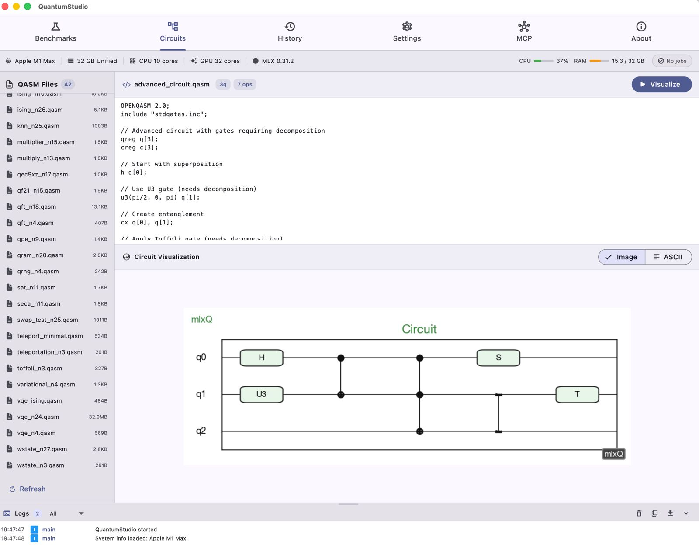
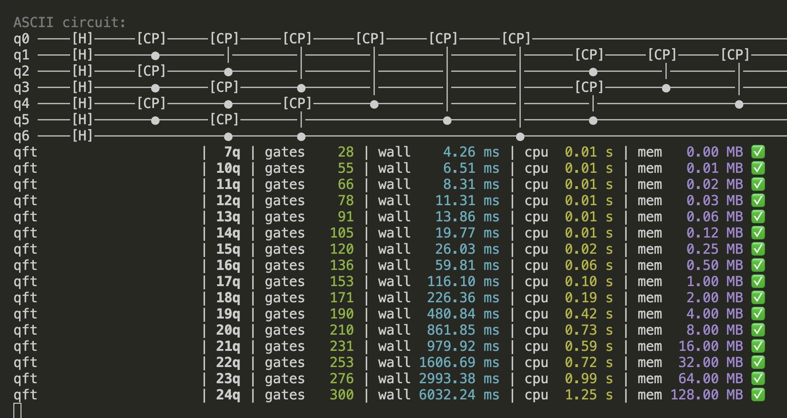
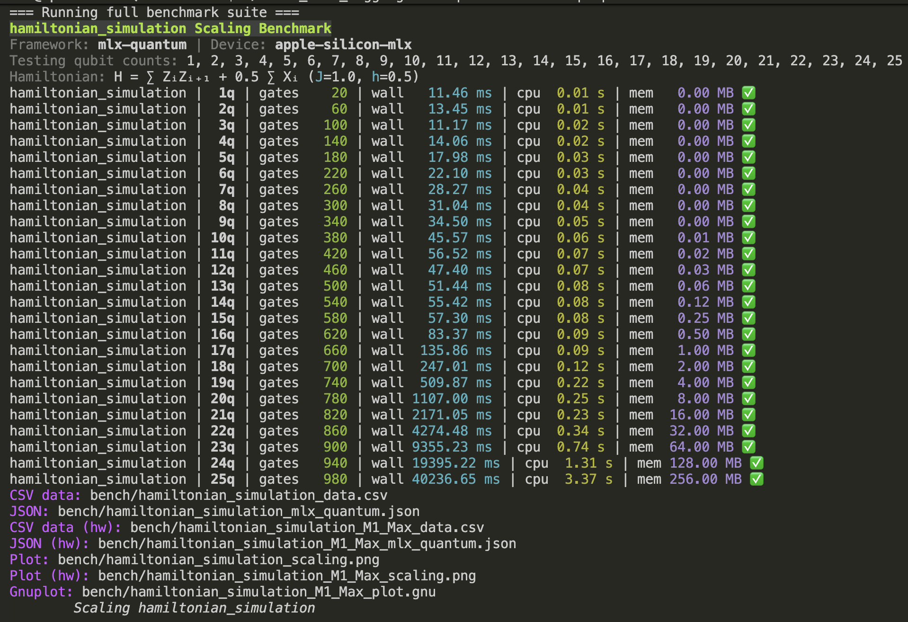
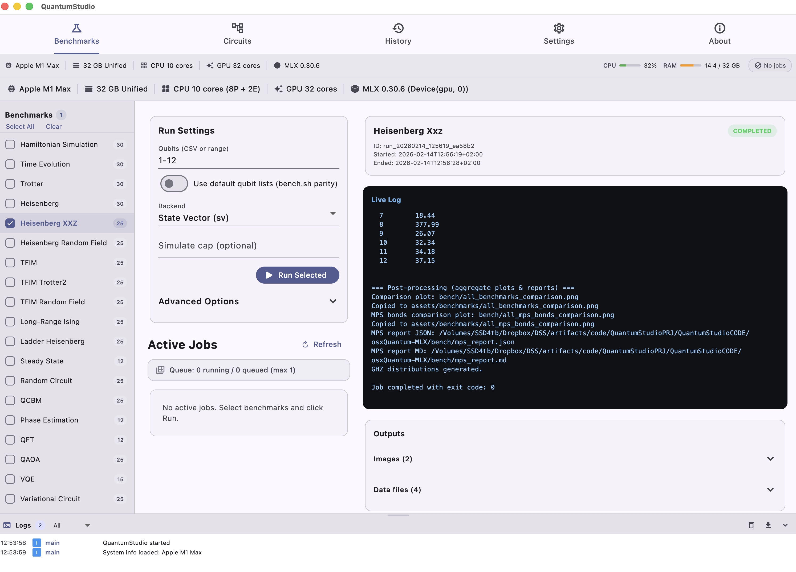
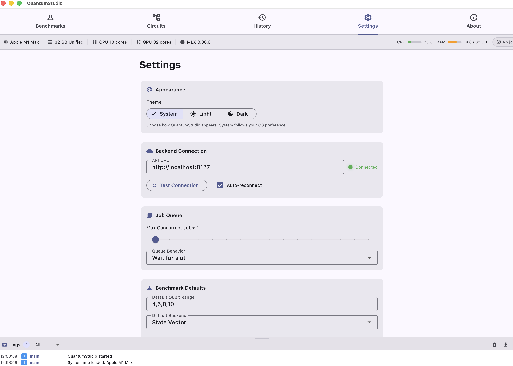
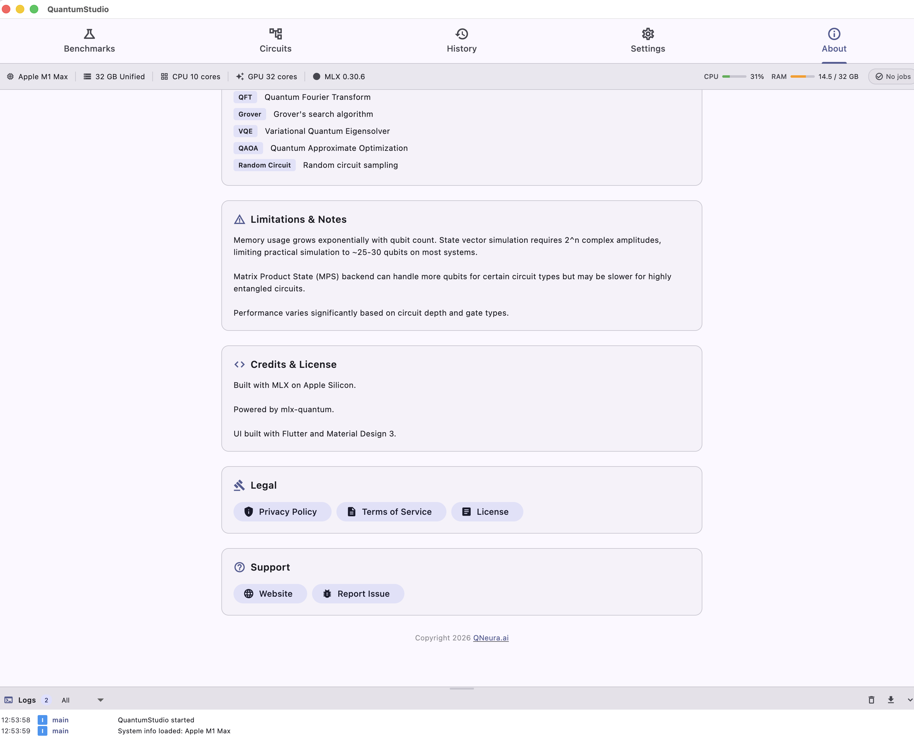

### Key Benchmark Figures (Paper)

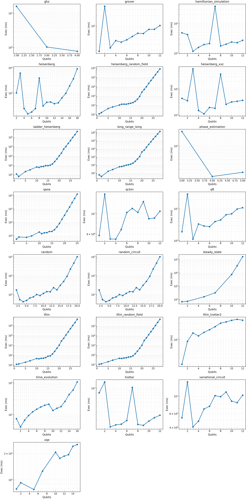
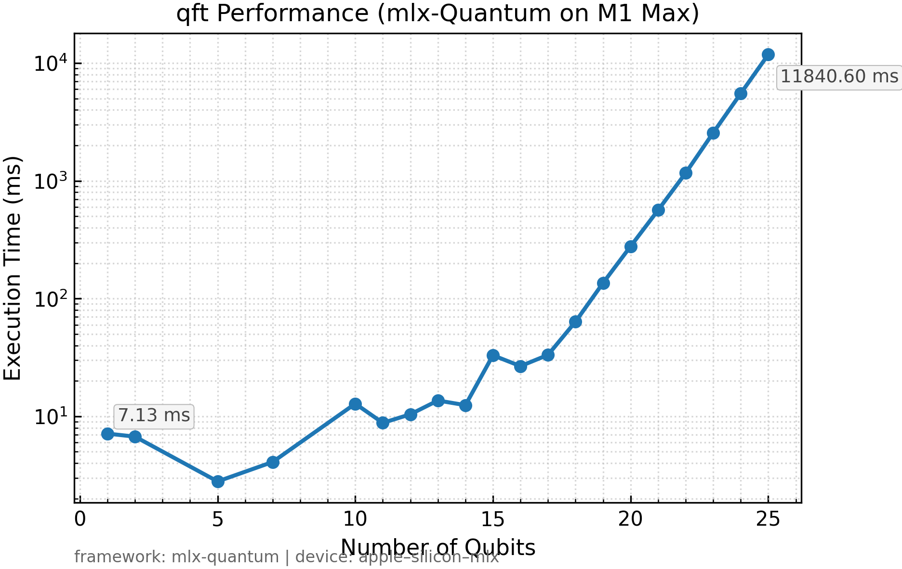
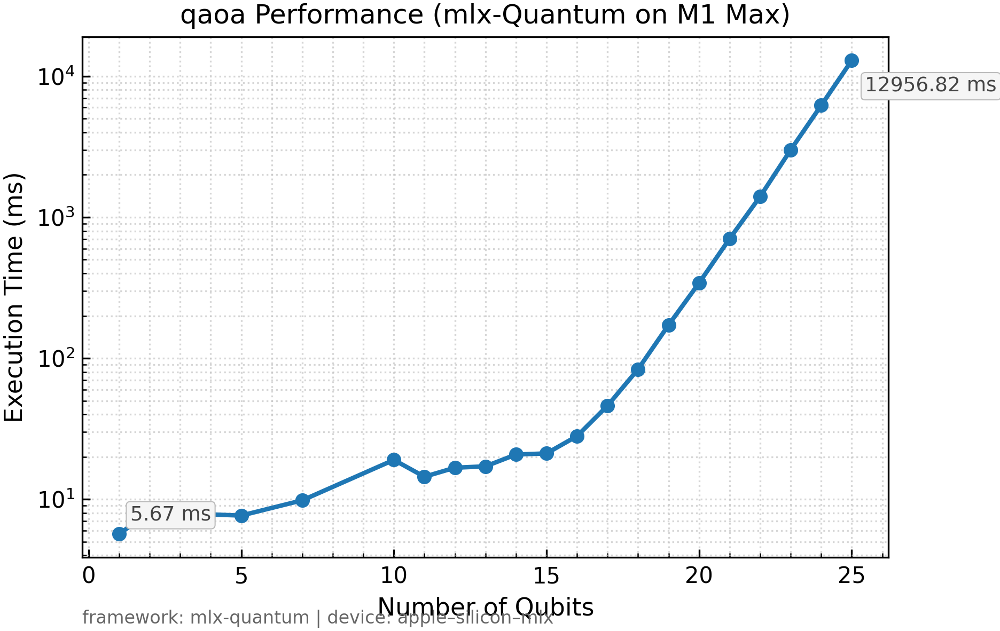
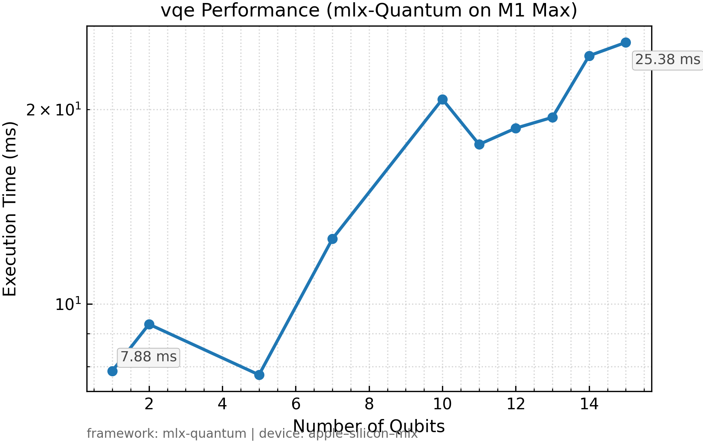
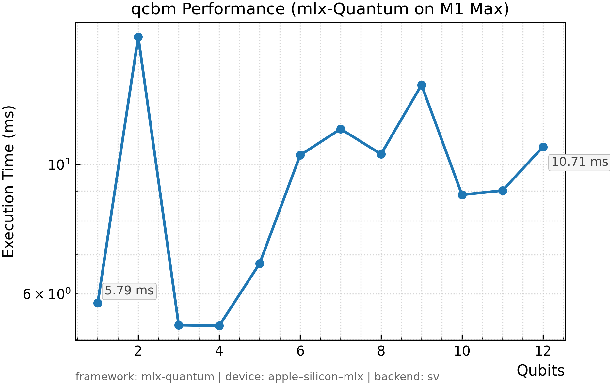
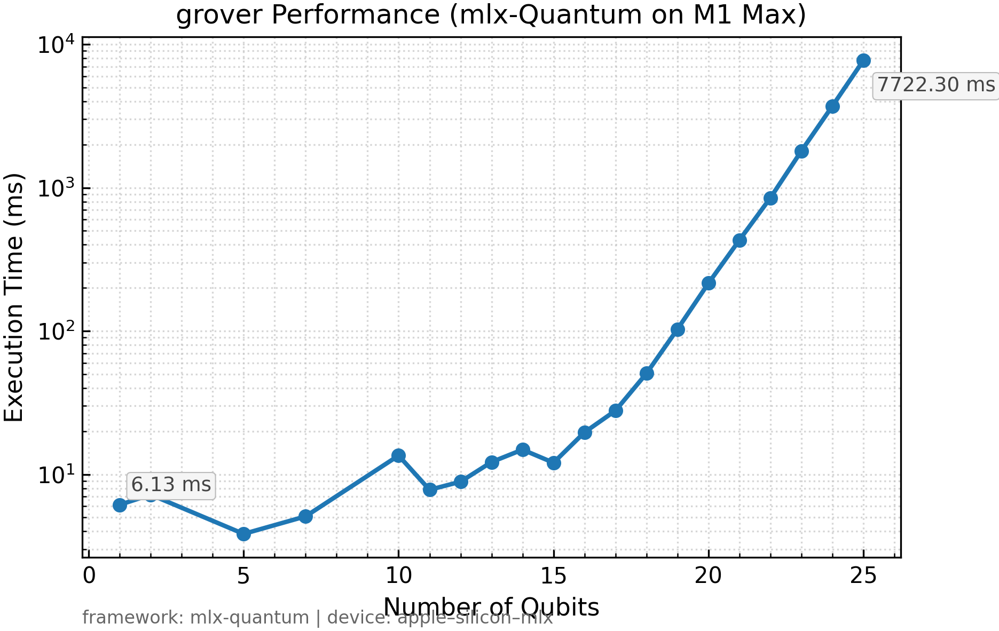
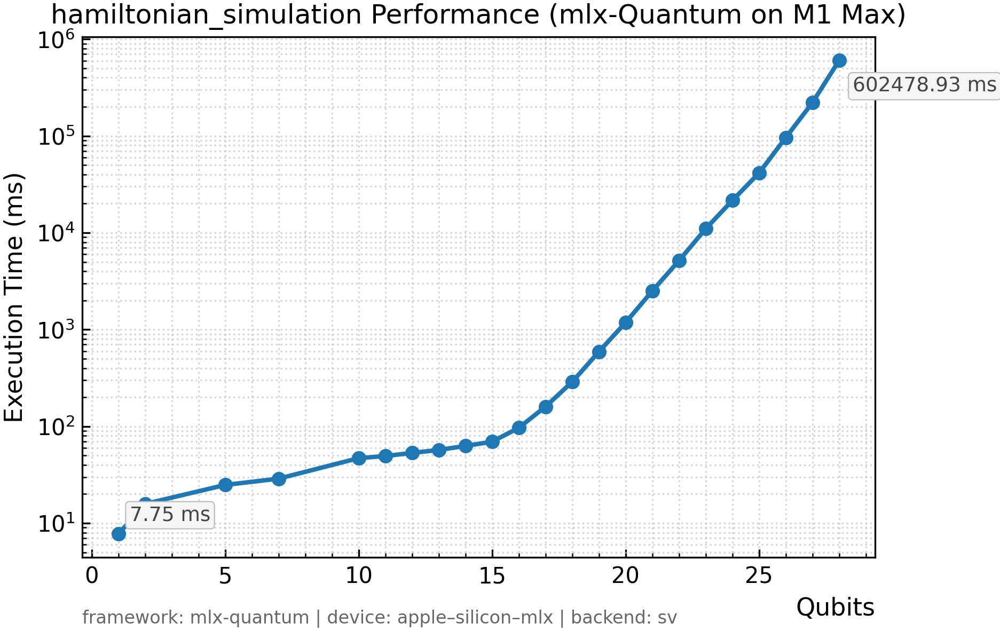
